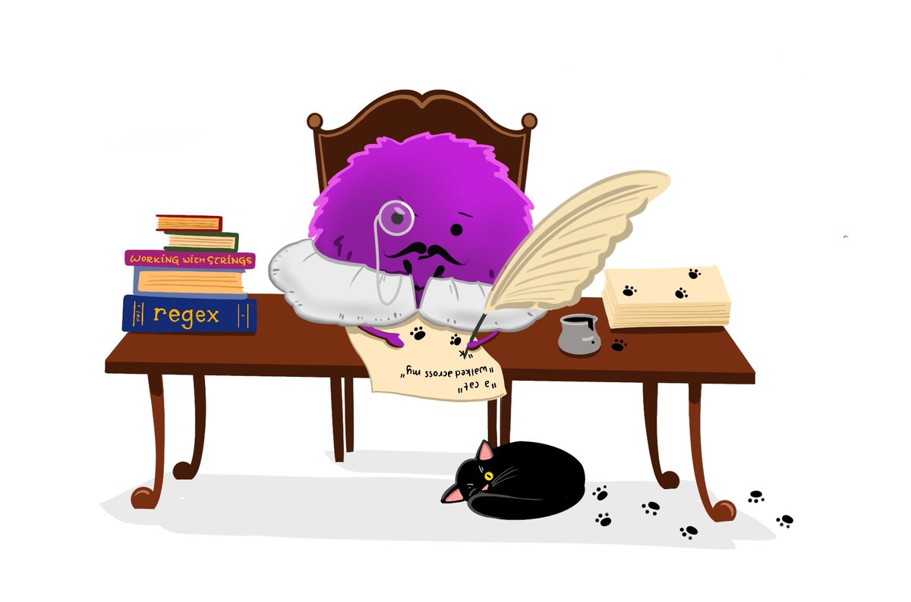
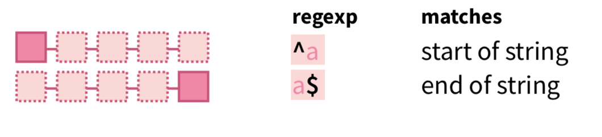
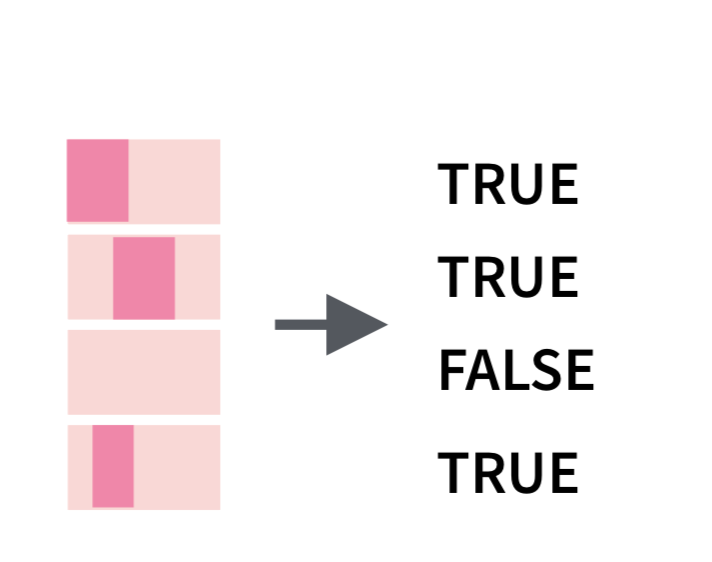
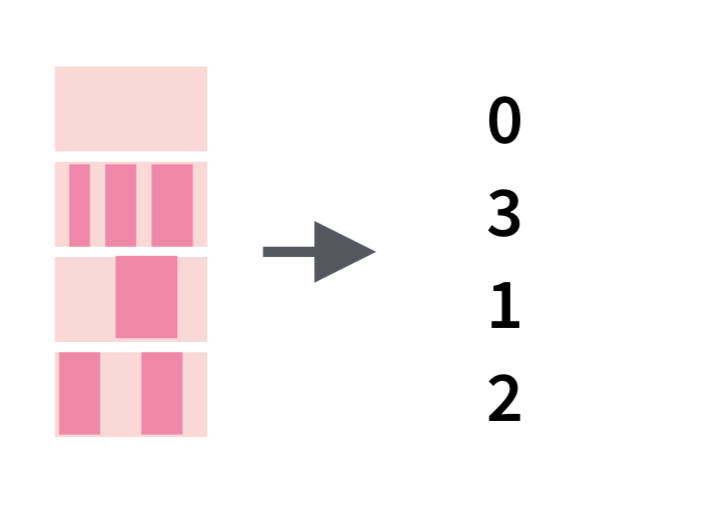

.footnote[Image by @allison_horst]

---
# Usage
- All functions start with `str_` 
- First argument is a vector of strings
- Work with **regular expressions**
  - concise language for describing patterns of text

---
#Key `stringr` functions


```{r echo=FALSE}
uses <- cbind(
  Problem = c("Lenth of a string",
              "Combining strings",
              "Convert letter case", 
          "Trim whitespace",
          "Detect a pattern",
          "Get strings/positions matching a pattern",
          "Extract/Replace"),
  Functions = c("str_length",
                 "str_c",
                "str_to_upper/lower/title",
                                "str_trim/squish",
                                "str_detect",
                                "str_subset/which",
                                "str_sub"))
knitr::kable(uses, format='html')

```

---
# Basics - String length

```{r cache=TRUE}
library(stringr)
str_length(c("a", "R for data science", NA))
```

---
# Basics - Combining strings
- Is it a vector or a string objects?
- Do you need a separator?


--

```{r}
str_c("x", "y", "z")
```
--

--> Use `sep` to control how they are seperated
```{r}
str_c("x", "y", sep = ", ")
```

--


--> To collapse a **vector** of strings into a single string, use `collapse`
```{r}
str_c(c("x", "y", "z"), collapse = ", ")
```


---
# Basics - Trim whitespace


.footnote[Artwork by Allison Horst]
---
class: inverse, middle, center

# Pattern matching with **Reg**ular **Ex**pressions

---
# Regular Expressions - Basics

Match exact strings
```{r}
x <- c("apple", "banana", "pear")
str_view(x, "an")
```

To match any character except a new line use `.`
```{r}
str_view(x, ".a.")
```
*How do we match a pattern with `.`?*  
To escape special character behaviour use `\`
We use strings to represent regular expressions, and `\`is also used as an escape symbol in strings. So to create the regular expression `\.` we need the string `"\\."`.

```{r}
str_view(c("abc", "a.c", "bef"), "a\\.c")
```
---
# Regular Expression - Anchors



.pull-left[
```{r}
x <- c("apple", "banana", "pear")
str_view(x, "^a")
```
]

.pull-right[
```{r}
x <- c("apple", "banana", "pear")
str_view(x, "a$")
```
]
---
# Regular Expressions - Character class and alternatives

- `\d`: matches any digit.
- `\s`: matches any whitespace (e.g. space, tab, newline).
- `[abc]`: matches a, b, or c.
- `[^abc]`: matches anything except a, b, or c.

---
# Regular Expressions - repetitions
*How many times a pattern matches?*
- `?`: 0 or 1
- `+`: 1 or more
- `*`: 0 or more

You can also specify the number of matches precisely:
- `{n}`: exactly n
- `{n,}`: n or more
- `{,m}`: at most m
- `{n,m}`: between n and m

---
# Pattern matching with RegEx
#### `str_detect`

.left-column[

]


.right-column[

```{r}
x <- c("apple", "banana", "pear")
str_detect(x, "e")
```

```{r}
# How many common words start with t?
sum(str_detect(words, "^t"))
# What proportion of common words end with a vowel?
mean(str_detect(words, "[aeiou]$"))
```

]
---
# Pattern matching with RegEx
#### `str_count`
.left-column[

]

.right-column[

```{r}
x <- c("apple", "banana", "pear")
str_count(x, "a")

# On average, how many vowels per word?
mean(str_count(words, "[aeiou]"))
```


]

---
# Pattern matching with RegEx
#### `str_subset/extract`
We want to find all sentences that have a color
```{r}
colours <- c("red", "orange", "yellow", "green", "blue", "purple")
colour_match <- str_c(colours, collapse = "|")
colour_match
```
```{r}
has_colour <- str_subset(sentences, colour_match)
matches <- str_extract(has_colour, colour_match)
head(matches)
```

NOTE  
`str_extract()` only extracts the first match.To get all matches, use `str_extract_all()`

---
# Pattern matching with RegEx
####  `str_replace`

```{r}
x <- c("apple", "pear", "banana")
str_replace(x, "[aeiou]", "-")
str_replace_all(x, "[aeiou]", "-")
```

---

# Other tools - splitting
#### `str_split`


```{r}
sentences %>%
  head(2) %>% 
  str_split(" ")
```

---

class: inverse, middle, center

#`Stringr` cheatsheet

---